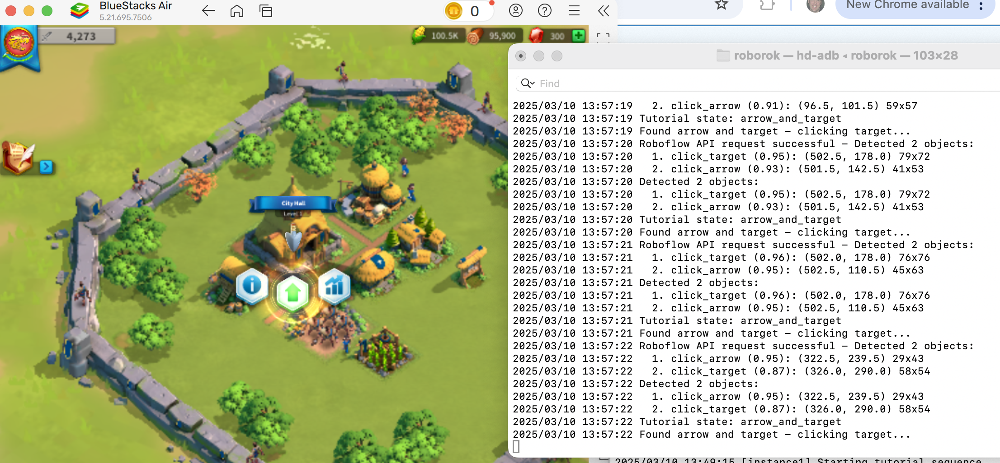
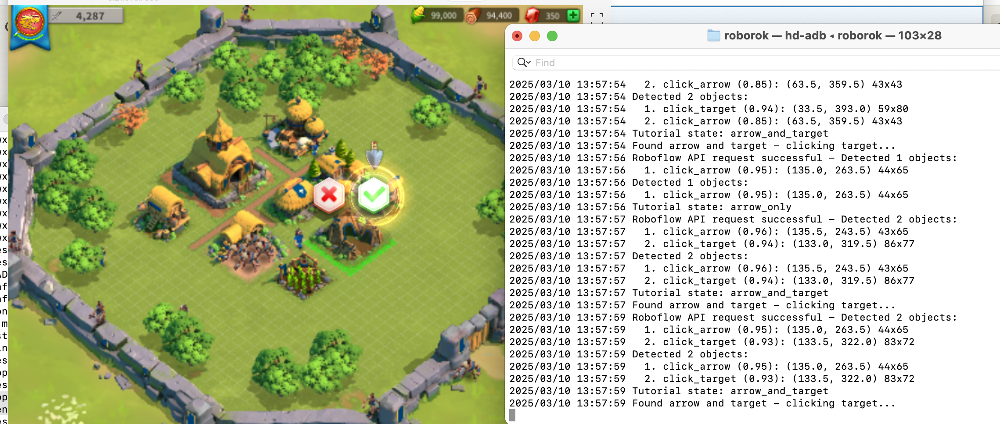

# RoboRok: Rise of Kingdoms Automation with Roboflow Vision AI

A sophisticated Python-based automation system that uses Roboflow's computer vision capabilities to intelligently play Rise of Kingdoms. This project demonstrates integration of computer vision AI with game automation.



## 🚀 Quickstart Guide (5 Minutes)

1. **Prerequisites:**
   - Python 3.7+
   - BlueStacks emulator
   - ADB tools
   - Roboflow account

2. **Setup:**
   ```bash
   # Clone the repository
   git clone https://github.com/jnesss/roborok.git
   cd roborok

   # Set up a virtual environment
   python -m venv venv
   source venv/bin/activate  # On Windows: venv\Scripts\activate

   # Install dependencies
   pip install -r requirements.txt
   
   # Configure your environment
   cp example_configs/basic_config.json config.json
   # Edit config.json with your Roboflow API key and device ID
   ```

3. **Run:**
   ```bash
   python -m roborok.main --config config.json
   ```

## 🔍 Project Overview

RoboRok connects Roboflow's powerful computer vision with ADB commands to automate gameplay in Rise of Kingdoms. This system automates:

- The tutorial sequence with civilization selection
- Resource gathering and building placement
- Early game optimization
- Quest completion
- Building upgrades

### System Architecture

```
┌─────────────────┐     ┌───────────────┐     ┌────────────────┐
│                 │     │               │     │                │
│ Vision System   │────▶│ State Machine │────▶│ Action System  │
│ (Roboflow API)  │     │ Manager       │     │ (ADB Commands) │
│                 │     │               │     │                │
└─────────────────┘     └───────────────┘     └────────────────┘
```

## 🧠 Computer Vision Integration

RoboRok uses two distinct Roboflow models:

1. **Tutorial Detection Model** - Identifies UI elements during the initial, laborious ROK tutorial
2. **Gameplay Detection Model** - Recognizes buildings, resources, and game state during regular game play

## 🎮 RoboRok in Action

### Tutorial Automation

The system precisely identifies tutorial elements with high confidence scores (often >95%), ensuring reliable automation of the tedious tutorial sequence.

### Gameplay Analysis

During normal gameplay, RoboRok analyzes the screen to detect multiple game elements simultaneously, enabling intelligent decision-making.

## ⚙️ Features

- **Computer Vision Integration:** Uses Roboflow's vision AI to detect game elements and make decisions
- **Multi-Instance Management:** Control multiple game instances with a single application
- **Tutorial Automation:** Automatically completes the tutorial with your preferred civilization
- **Building Optimization:** Smart building placement and upgrade sequencing
- **Resource Management:** Efficiently harvests resources and completes tasks
- **State Machine Architecture:** Robust state-based decision making system

## 🛠️ Technical Details

RoboRok is built with Python and follows a modular architecture:

- **State Machine:** Central system for managing game state and transitions
- **Vision System:** Integrates with Roboflow for visual recognition
- **Action System:** Implements game actions (upgrading, training, etc.)
- **Task Management:** Prioritizes and executes tasks based on game state
- **Persistence:** Tracks and saves game state between sessions

## 📊 Project Structure

```
roborok/
├── roborok/            # Main package directory
│   ├── __init__.py     # Package initialization
│   ├── actions/        # Game action implementations
│   ├── vision/         # Computer vision integration
│   ├── state_machine/  # State management system
│   ├── utils/          # Utility functions and helpers
│   ├── models.py       # Data models and classes
│   ├── tasks.py        # Task management system
│   └── main.py         # Main entry point
├── tests/              # Test suite
├── docs/               # Documentation
├── example_configs/    # Example configuration files
├── setup.py            # Package installation
└── requirements.txt    # Dependencies
```

## 🔧 Setup and Configuration

See the [detailed setup guide](SETUP.md) for complete installation instructions.

### Configuration Example

```json
{
  "global": {
    "roboflow_api_key": "YOUR_API_KEY_HERE",
    "roboflow_tutorial_model_id": "rok_tutorial/1",
    "roboflow_gameplay_model_id": "rok_gameplay/1",
    "refresh_interval_ms": 1000,
    "report_endpoint": "http://localhost:3000/api/stats",
    "reporting_interval_s": 300
  },
  "instances": {
    "instance1": {
      "device_id": "127.0.0.1:5555",
      "preferred_civilization": "china"
    }
  },
  "gameplay": {
    "adb_path": "/Applications/BlueStacks.app/Contents/MacOS/hd-adb",
    "startup_tasks": [
      "clear_trees",
      "recruit_second_builder"
    ]
  }
}
```

## 🧪 Training Custom Computer Vision Models

You can train your own computer vision models for RoboRok. Follow our [training guide](TRAINING_DATA.md).

## 📖 Related Content

- [**Recursive Automation: Using AI to Train Better AI for Game Bots**](https://jnesss.github.io/2025/03/23/recursive-automation.html) - Detailed blog post about the development process, challenges in OCR implementation, and how Claude AI was used to help train the computer vision models.

- [**Video Demo: RoboRok in Action**](https://youtu.be/Z8XkNGI6F4w) - Early demonstration of the project showing how computer vision is used to automate the Rise of Kingdoms tutorial. Note: The project has evolved from Go to Python since this video was created, but the core concepts remain the same.
  
## 🤝 Contributing

Contributions are welcome! Please feel free to submit a Pull Request.

## 📝 License

This project is licensed under the MIT License - see the [LICENSE](LICENSE) file for details.
