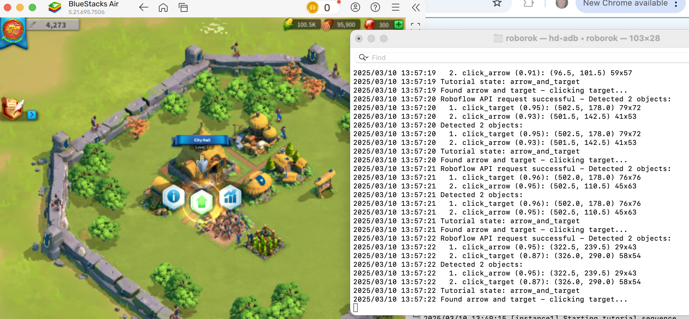
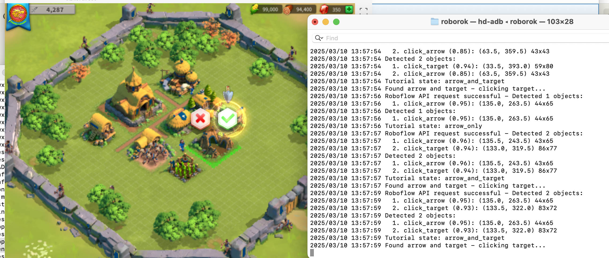
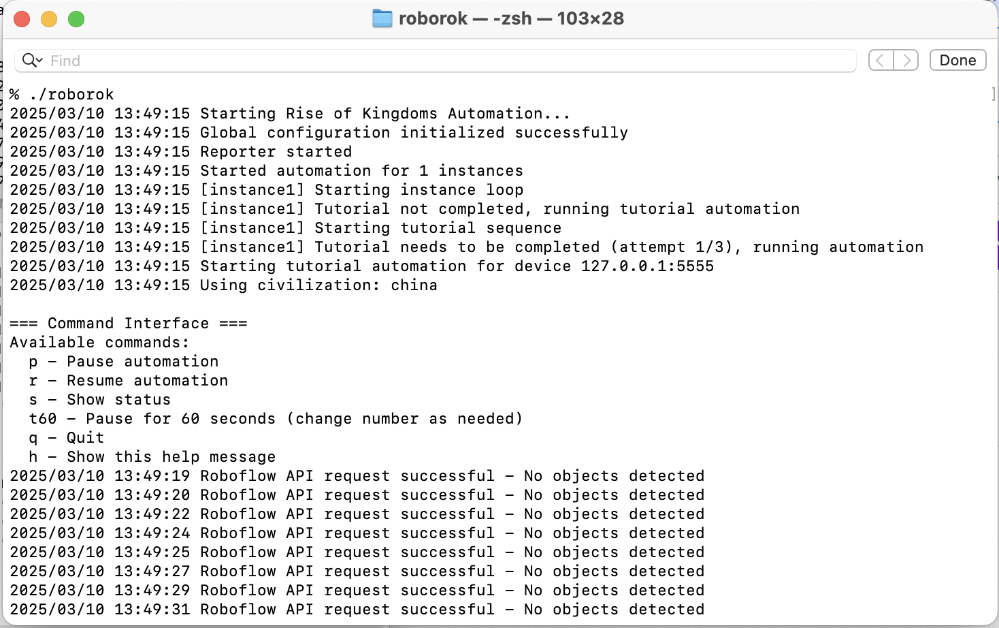

# RoboRok: Rise of Kingdoms Automation with Roboflow Vision AI

A sophisticated automation system that uses Roboflow's computer vision capabilities to intelligently play Rise of Kingdoms. This project demonstrates integration of computer vision AI with game automation.



## 🚀 Quickstart Guide (5 Minutes)

1. **Prerequisites:**
   - Go 1.16+
   - BlueStacks emulator
   - ADB tools
   - Roboflow account

2. **Setup:**
   ```bash
   # Clone the repository
   git clone https://github.com/jnesss/roborok.git
   cd roborok

   # Configure your environment
   cp config.example.json config.json
   # Edit config.json with your Roboflow API key and device ID
   
   # Build the application
   go build
   ```

3. **Run:**
   ```bash
   ./roborok
   ```

Watch the [demo video](https://youtube.com/your-video-link) to see it in action!

## 🔍 Project Overview

RoboRok connects Roboflow's powerful computer vision with ADB commands to automate gameplay in Rise of Kingdoms. This initial version automates:

- The tutorial sequence with civilization selection
- Resource gathering and building placement
- Early game optimization

### System Architecture

```
┌─────────────────┐     ┌───────────────┐     ┌────────────────┐
│                 │     │               │     │                │
│ Vision System   │────▶│ Game State    │────▶│ Action System  │
│ (Roboflow API)  │     │ Management    │     │ (ADB Commands) │
│                 │     │               │     │                │
└─────────────────┘     └───────────────┘     └────────────────┘
```

## 🧠 Computer Vision Integration

RoboRok uses two distinct Roboflow models:

1. **Tutorial Detection Model** - Identifies UI elements during the initial, laborious ROK tutorial
2. **Gameplay Detection Model** - Recognizes buildings, resources, and game state during regular game play

[Learn more about the models and training data](./TRAINING_DATA.md)

## 🎮 RoboRok in Action

### Tutorial Automation

The system precisely identifies tutorial elements with high confidence scores (often >95%), ensuring reliable automation of the tedious tutorial sequence.

### Gameplay Analysis

During normal gameplay, RoboRok analyzes the screen to detect multiple game elements simultaneously, enabling intelligent decision-making.

### Console Interface

The intuitive command interface lets you control the automation in real-time.

## ⚙️ Features

- **Computer Vision Integration:** Uses Roboflow's vision AI to detect game elements and make decisions
- **Multi-Instance Management:** Control multiple game instances with a single application
- **Tutorial Automation:** Automatically completes the tutorial with your preferred civilization
- **Building Optimization:** Smart building placement and upgrade sequencing
- **Resource Management:** Efficiently harvests resources and completes tasks (coming soon..)

## 🛠️ Technical Details

RoboRok is built with Go and follows a modular architecture:

- **Instance Manager:** Coordinates multiple game instances
- **Vision System:** Integrates with Roboflow for visual recognition
- **Action System:** Implements game actions (upgrading, training, etc.)
- **State Management:** Tracks and persists game state

## 📊 Results

The system successfully automates the early game with high reliability:
- Tutorial completion: 95% success rate
- Initial city tree clearing rate: 80% success rate
- Building placement accuracy up to City Hall level 5: 60% success rate (improving quickly though!)

## 🔧 Setup and Configuration

See the [detailed setup guide](./SETUP.md) for complete installation instructions.

## 🧪 Training Your Own Models

You can train your own computer vision model for RoboRok! Roboflow is awesome! You'll love using it! Follow our [training guide](./TRAINING_DATA.md).

## 📝 License

This project is licensed under the Apache 2.0 License - see the [LICENSE](LICENSE) file for details.