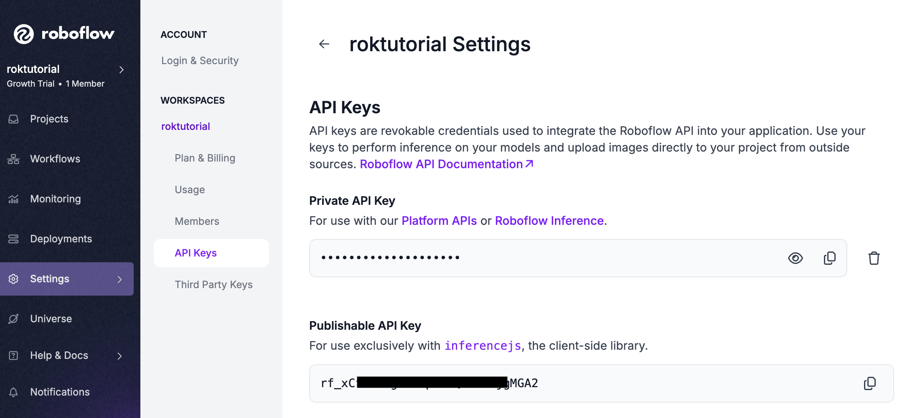
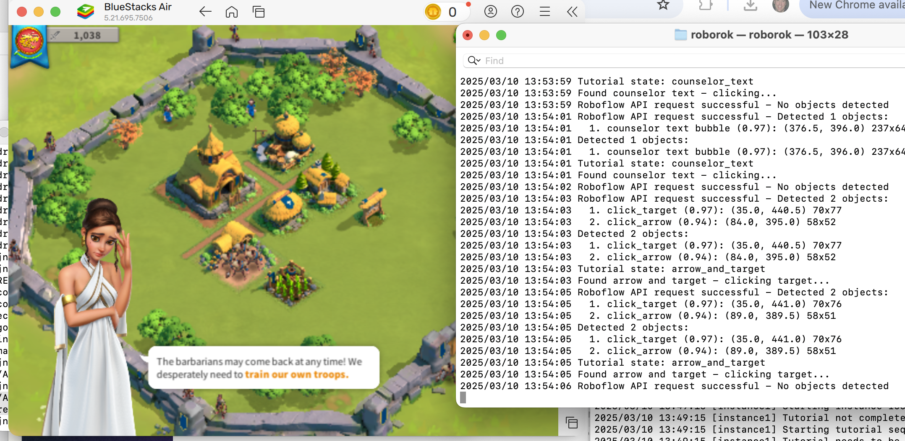

# RoboRok Setup Guide

This guide walks you through the complete setup process for RoboRok, from installing prerequisites to running your first automation session.

## Prerequisites

- Go 1.16 or higher
- BlueStacks or another Android emulator
- ADB tools (included with BlueStacks)
- Roboflow account (free tier works fine)
- Rise of Kingdoms installed in your emulator

## Step 1: Install BlueStacks

1. Download BlueStacks from [bluestacks.com](https://www.bluestacks.com)
2. Follow the installation instructions for your operating system
3. Once installed, launch BlueStacks and install Rise of Kingdoms from the Play Store

## Step 2: Configure ADB Connection

1. Locate the ADB executable in your BlueStacks installation:
   - macOS: `/Applications/BlueStacks.app/Contents/MacOS/hd-adb`
   - Windows: `C:\Program Files\BlueStacks_nxt\HD-Adb.exe`

2. Connect to the BlueStacks instance:
   ```bash
   /Applications/BlueStacks.app/Contents/MacOS/hd-adb connect 127.0.0.1:5555
   ```

3. Verify the connection:
   ```bash
   /Applications/BlueStacks.app/Contents/MacOS/hd-adb devices
   ```
   
   You should see output like this:
   ```
   List of devices attached
   127.0.0.1:5555 device
   ```

4. Test that you can capture screenshots:
   ```bash
   # Save screenshot to file
   /Applications/BlueStacks.app/Contents/MacOS/hd-adb -s 127.0.0.1:5555 exec-out screencap -p > screenshot.png
   
   # Or view directly on macOS
   /Applications/BlueStacks.app/Contents/MacOS/hd-adb -s 127.0.0.1:5555 exec-out screencap -p | open -a Preview.app -f
   ```

## Step 3: Setup Roboflow and Get API Key

1. Create a Roboflow account at [roboflow.com](https://roboflow.com) if you haven't already
2. Create and train your models as described in [TRAINING_DATA.md](./TRAINING_DATA.md)
3. To find your API key, go to the workspace settings or API Keys section:



4. Copy your API key (you'll need it for the config file)

## Step 4: Configure RoboRok

1. Clone the repository:
   ```bash
   git clone https://github.com/jnesss/roborok.git
   cd roborok
   ```

2. Create your configuration file:
   ```bash
   cp config.example.json config.json
   ```

3. Open and edit `config.json` with your details:
   ```json
   {
     "global": {
       "roboflow_api_key": "YOUR_API_KEY_HERE",
       "roboflow_tutorial_model_id": "rok_tutorial/1",
       "roboflow_gameplay_model_id": "rok_gameplay/1",
       "refresh_interval_ms": 1000,
       "report_endpoint": "http://localhost:3000/api/stats",
       "reporting_interval_s": 300
     },
     "instances": {
       "instance1": {
         "device_id": "127.0.0.1:5555",
         "preferred_civilization": "china",
         "claim_quests": true,
         "claim_only_main_quest": false,
         "enable_scout_micromanagement": true
       }
     },
     "gameplay": {
       "adb_path": "/Applications/BlueStacks.app/Contents/MacOS/hd-adb",
       "startup_tasks": [
         "clear_trees",
         "recruit_second_builder"
       ],
       "max_city_hall_level": 25,
       "preferred_alliance": "YourAllianceName",
       "join_random_alliance": true,
       "research_path": [
         "agriculture",
         "military_science",
         "iron_working",
         "mathematics"
       ],
       "building_levels": {
         "city_hall": 25,
         "barracks": 25,
         "archery_range": 25,
         "stable": 25,
         "siege_workshop": 25,
         "academy": 25
       },
       "troop_levels": {
         "infantry": 0,
         "archers": 0,
         "cavalry": 0,
         "siege": 0
       }
     }
   }
   ```

   > Note: Standard JSON does not support comments. Do not add comment lines to your config.json file or the application will fail to parse it.

   ### Configuration Explanation

   #### Global Settings
   - `roboflow_api_key`: Your personal Roboflow API key (find in your account settings)
   - `roboflow_tutorial_model_id`: The model ID for tutorial detection (format: "project/version")
   - `roboflow_gameplay_model_id`: The model ID for gameplay element detection
   - `refresh_interval_ms`: Time between automation cycles in milliseconds
   - `report_endpoint`: Endpoint for reporting statistics (optional)
   - `reporting_interval_s`: How often to send reports in seconds

   #### Instance Settings
   - `device_id`: ADB device identifier for your emulator
   - `preferred_civilization`: Which civilization to select during tutorial
   - `claim_quests`: Whether to automatically claim completed quests
   - `claim_only_main_quest`: If true, only claim main storyline quests
   - `enable_scout_micromanagement`: Controls scout automation behavior

   #### Gameplay Settings
   - `adb_path`: Path to the ADB executable on your system
   - `startup_tasks`: Initial tasks to complete before regular automation
   - `max_city_hall_level`: Target level to upgrade City Hall
   - `preferred_alliance`: Alliance to attempt joining
   - `join_random_alliance`: If true, join any alliance if preferred not found
   - `research_path`: Technologies to research in priority order
   - `building_levels`: Maximum levels for various buildings
   - `troop_levels`: Troop training settings (0 = maximum available)

## Step 5: Build and Run

1. Build the application:
   ```bash
   go build
   ```

2. Run RoboRok:
   ```bash
   ./roborok
   ```

3. When you start the application, you'll see console output showing the initialization process and command interface:

   

4. Use the command interface to control RoboRok:
   - `p` - Pause automation
   - `r` - Resume automation
   - `s` - Show status
   - `t60` - Pause for 60 seconds
   - `q` - Quit
   - `h` - Show help

## RoboRok in Action

Once running, RoboRok will automatically control the game by detecting UI elements and responding appropriately. Here are some examples of the system in action:

### Tutorial Navigation

The system automatically detects tutorial arrows and targets with high confidence scores, then clicks at the correct locations:


### Multiple Detection Types

RoboRok can identify different types of UI elements, including text bubbles and interactive elements:



### Building and Game State Detection

It detects buildings and game state indicators to make strategic decisions:


## Troubleshooting

### ADB Connection Issues

If you have trouble connecting to BlueStacks:

1. Make sure BlueStacks is running
2. Try restarting the ADB server:
   ```bash
   /Applications/BlueStacks.app/Contents/MacOS/hd-adb kill-server
   /Applications/BlueStacks.app/Contents/MacOS/hd-adb start-server
   ```
3. Reconnect to the device:
   ```bash
   /Applications/BlueStacks.app/Contents/MacOS/hd-adb connect 127.0.0.1:5555
   ```

### Model Detection Issues

If the computer vision detection isn't working correctly:

1. Verify your API key is correct
2. Check that your model IDs are entered correctly
3. Make sure you have internet connectivity
4. Test your models manually in the Roboflow interface
5. Check console logs for any errors

### Game Automation Issues

If the automation seems to be working incorrectly:

1. Different resolutions can affect detection - ensure BlueStacks is set to 1280x720 resolution
2. Make sure Rise of Kingdoms is in English
3. Try running with default settings first, then customize once working

## Next Steps

Once your automation is running successfully:

1. Fine-tune building placement and upgrade sequences
2. Customize the build order for your preferred strategy
3. Consider contributing improvements back to the project

For advanced usage and customization options, see the main [README.md](./README.md) file.