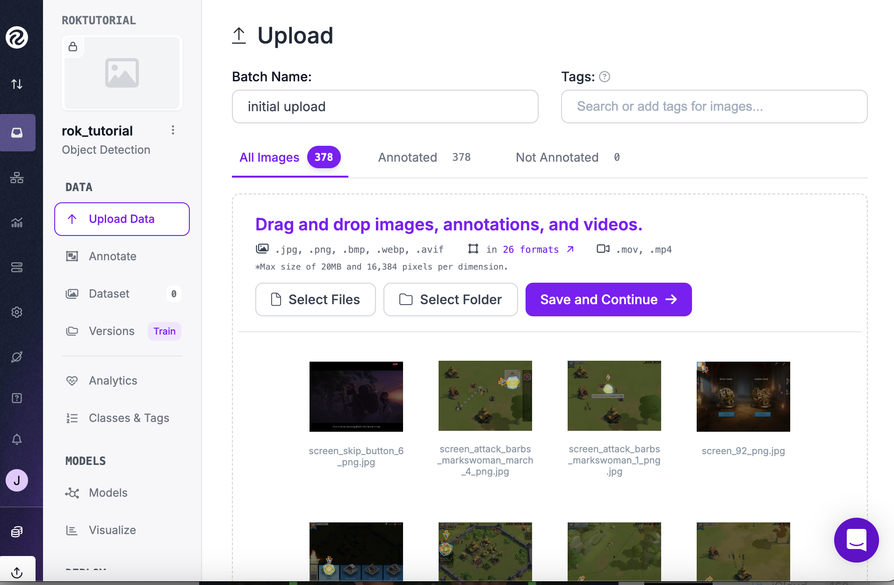
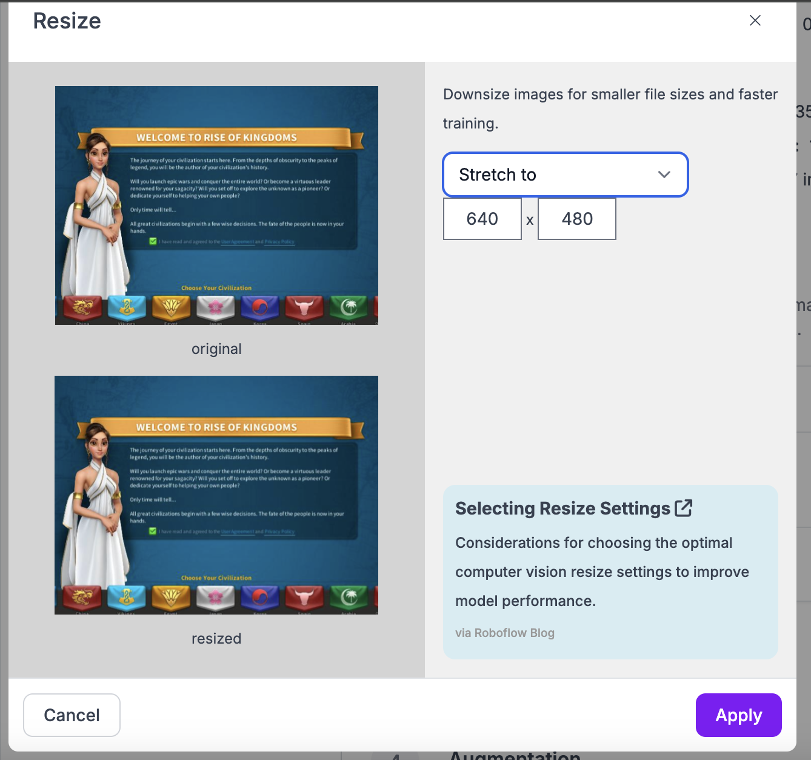
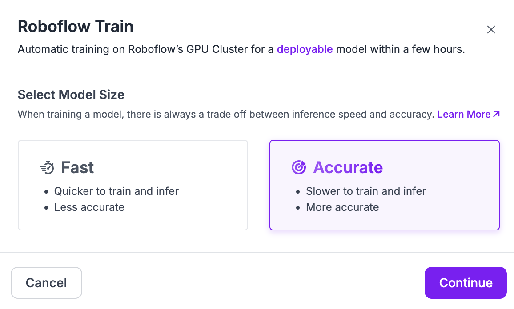
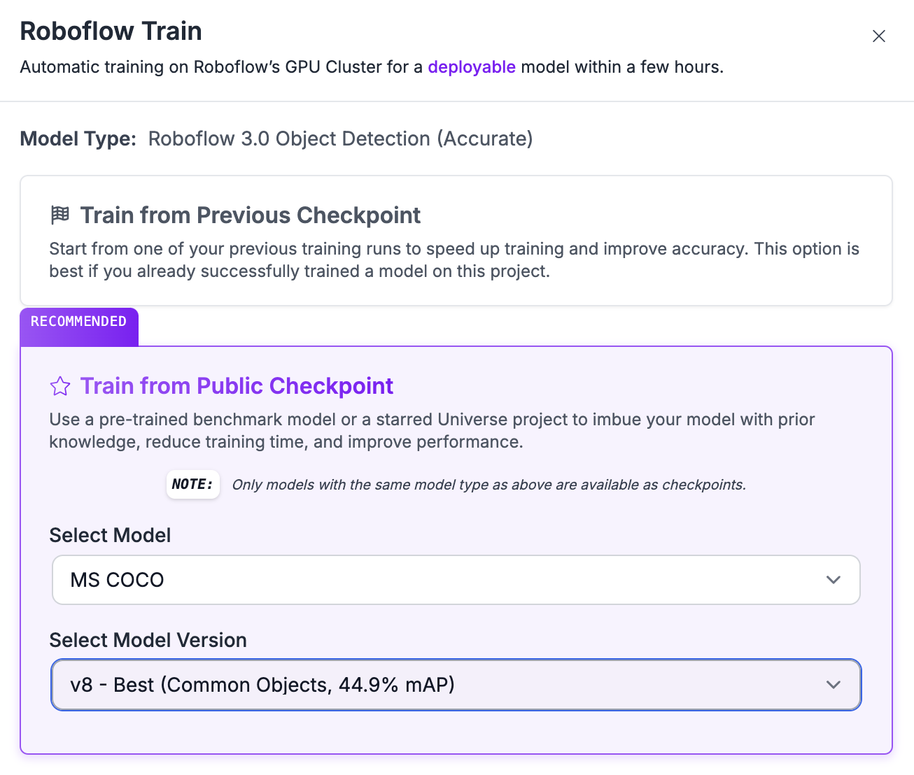

# RoboRok Computer Vision Training Data

This document explains the computer vision models used in RoboRok and provides resources to create your own models.

## Models Overview

RoboRok uses two specialized computer vision models:

### 1. Tutorial Detection Model

This model identifies UI elements that primarily appear during the Rise of Kingdoms tutorial sequence:

- **Classes:** 15 total including:
  - `click_arrow` - Tutorial direction arrows
  - `click_target` - Clickable targets
  - `confirm_button` - Confirmation buttons
  - `skip_button` - Tutorial skip options
  - Various civilization options (`china`, `britain`, `rome`, etc.)

- **Model Type:** YOLOv8n for fast inference
- **Training Dataset:** 84 annotated screenshots

Playing the tutorial is a very rigid gameplay experience, making it laborious and a chore to complete for the 23948273489th time during your Rise of Kingdom play journey. This model contains only the specific elements needed to complete the tutorial before actual game play starts.

The primary mechanism to navigate the tutorial is watching for both the click_arrow and the click_target to appear. The annotated screenshots include many configurations of both the click arrow and click target. Bright flashes of light throughout the tutorial gameplay will often result in detection of click_target. It would be insufficient to click on each click_target.  

Similarly, the click_arrow sometimes appears a half second before the glowing click target appears. Attempting to gauge the direction of the arrow and clicking a few pixels in that direction would be an unreliable method of completing the tutorial. It's best to wait for both to appear and then click on the center of the click_target.  

All code related to tutorial detection and automation is present in one file: internal/actions/tutorial.go. It's fairly simple to understand and once you train a model with the included screenshots, you'll get very high probability detection indicators (95+%) and reliable tutorial completion.

### 2. Gameplay Detection Model

This model detects in-game elements during normal gameplay:

- **Classes:** 25+ total including:
  - Buildings (`city_hall`, `barracks`, `farm`, etc.)
  - Resources (`tree`, `stone`, `gold_mine`)
  - UI elements (`builders_hut`, `alliance_help_button`)
  - Game state indicators (`in_city`, `in_build`, `on_field`)

- **Model Type:** YOLOv8s for balanced speed/accuracy
- **Training Dataset:** 130+ annotated screenshots

Actual game play is, of course, much more complex. Every screen will have multiple detection classes reported. The Go code logic is included in the Go files build-order.go, navigation.go, quests.go, scout.go, second-builder.go, tavern.go, trees.go, troops.go, and vip.go.

## Training Resources

To train your own models, you are welcome to use our annotated datasets:

1. [Download Tutorial Dataset (COCO JSON)](https://drive.google.com/file/d/1o1_uxwquFUdRF7H27NZo49rKIhQ5BpA5/view?usp=sharing)
2. [Download Gameplay Dataset (COCO JSON)](https://drive.google.com/file/d/1nUejCGeHmUt_EK4fsrqm-GVG5-A0Jf9r/view?usp=sharing)

## Training Process

### Step 1: Create a New Project

1. Create a free Roboflow account at [roboflow.com](https://roboflow.com)
2. Click "Create New Project" and select "Object Detection" as the project type
3. Name your project (e.g., "rok_tutorial" or "rok_gameplay")


### Step 2: Import Dataset to Roboflow

1. Upload the downloaded dataset (drag and drop the folder)
2. The platform will process your images and annotations
3. After upload completes, you'll see your images with annotations



4. Click "Add Approved to Dataset" to finalize the import


### Step 3: Generate a Dataset Version

1. Create a new version of your dataset
2. Configure preprocessing:
   - Auto-Orient: Applied
   - Resize: Stretch to 640×480 (aspect ratio of captured screenshots)




3. Add augmentations for improved performance:
   - Brightness: ±10%


4. Review train/validation/test splits
   - Training Set: ~80% of images
   - Validation Set: ~10% of images 
   - Testing Set: ~10% of images
5. Click "Create" to generate your dataset version


### Step 4: Train Your Model

1. Go to the Train tab and click "Start Training"
2. Select model architecture: Roboflow 3.0


3. Select model size (Accurate is fine for turn-based gameplay)



4. Choose training checkpoint: MS COCO



5. Click "Start Training" and wait for the model to complete training (may take 1-2 hours if you added 10x images)

### Step 5: Deploy Model

1. Once training completes, go to the "Deploy" tab
2. Copy your model ID and API key
3. Update your `config.json` with these values:

```json
{
  "global": {
    "roboflow_api_key": "YOUR_API_KEY",
    "roboflow_tutorial_model_id": "rok_tutorial/1",
    "roboflow_gameplay_model_id": "rok_gameplay/1",
    ...
  }
}
```

## Annotation Guidelines

If you want to expand the dataset:

1. **Tutorial Model:**
   - Capture screenshots during the tutorial sequence
   - Label all interactive elements and indicators
   - Ensure each civilization option is labeled in multiple orientations
   
The Tutorial flow is configured to work well for China, my preferred starting civilization. Very little testing has been done to support other civilization choices so that would be a great place to do more screenshots and labeling.

2. **Gameplay Model:**
   - Capture screenshots in both city and field views
   - Label all buildings completely, even when partially obscured
   - Include UI elements that indicate game state

Most of the work up until now has been in build-order.go for initial starting buildings up to City Hall Level 4.

## Model Performance

Current model performance metrics:

| Model | mAP@0.5 | Precision | Recall |
|-------|---------|-----------|--------|
| Tutorial | 0.92 | 0.89 | 0.94 |
| Gameplay | 0.87 | 0.85 | 0.90 |

## Fine-tuning Tips

- Add more examples of rare classes to improve detection
- Increase augmentations if deploying to different devices/resolutions
- Consider YOLOv8m for higher accuracy if running on powerful hardware